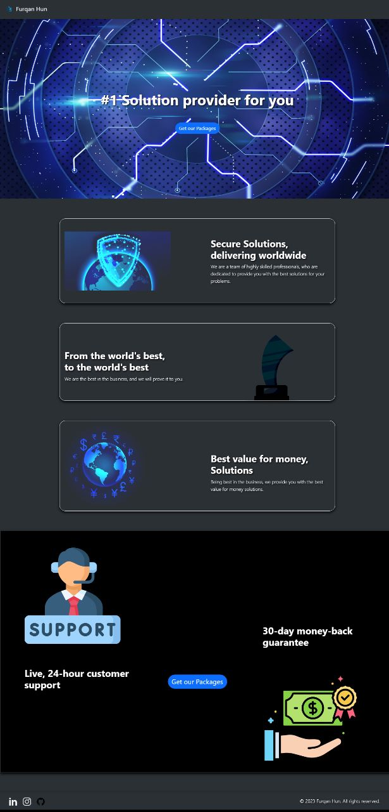
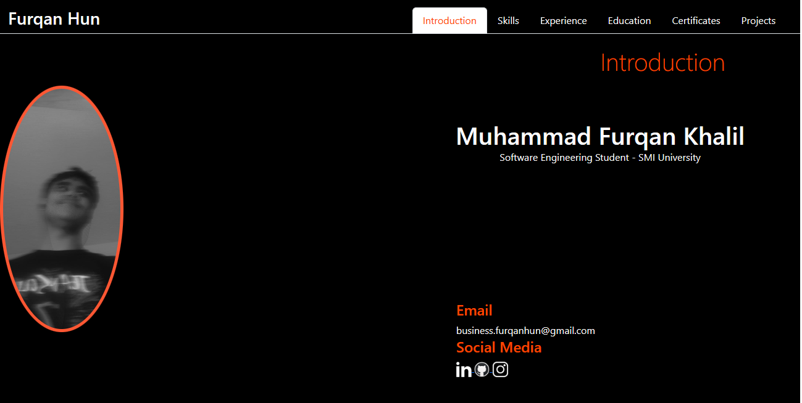
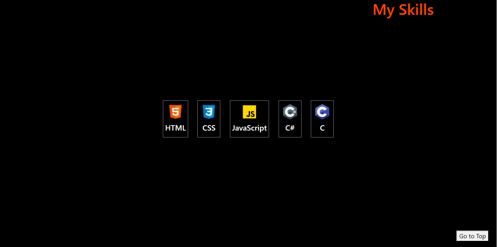
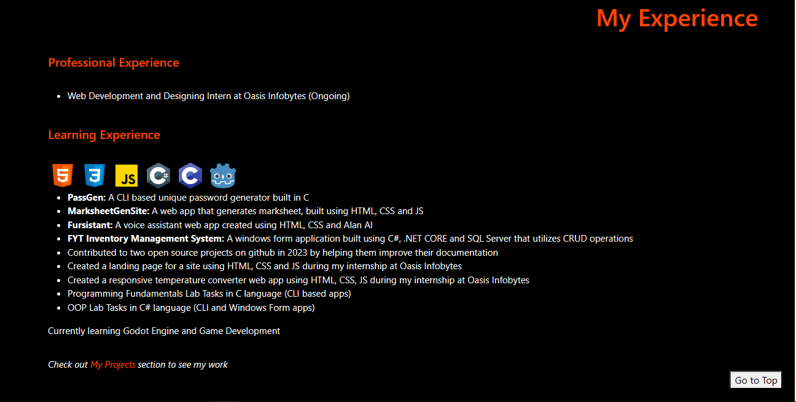
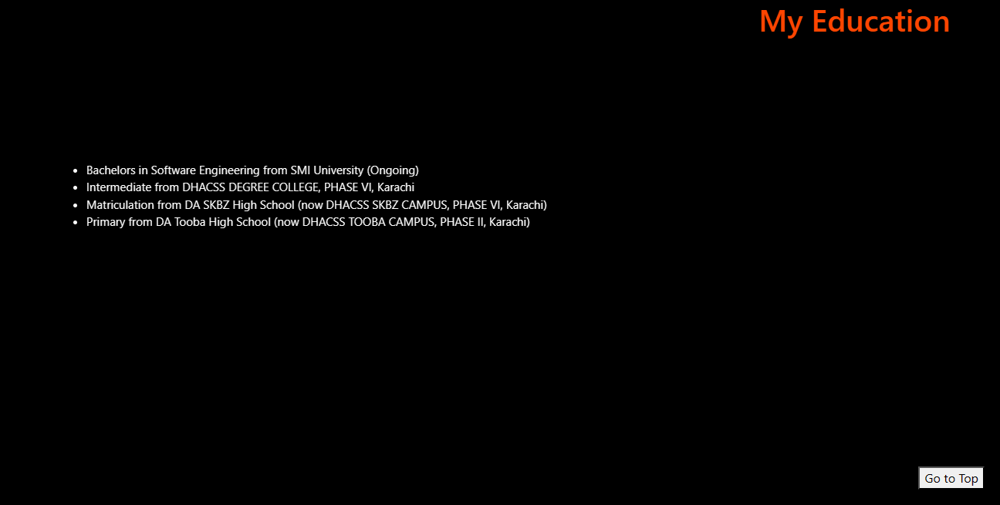
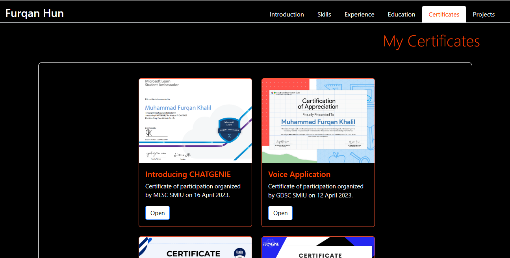
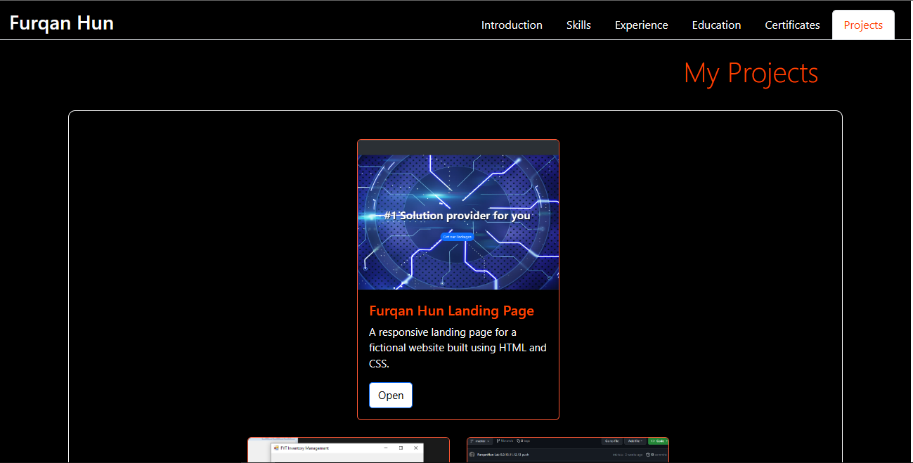
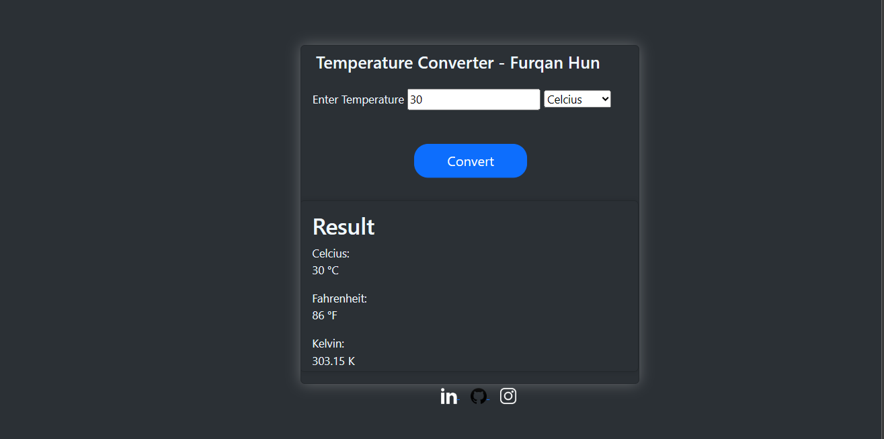

# OIBSIP

## Description
This repo contains my Web Development and Designing Internship tasks for OASIS INFOBYTE.

# Task 1
## Description
This task was to create a simple landing page for a website using HTML and CSS.
You can check the site out [here](https://landingpage-furqanhun.netlify.app/)

## Screenshots

# Task 2
## Description
For this task i had to create a portfolio site using HTML, CSS and JS. I also used Bootstrap for some compnents, the site contaons a main page that contaiins a navbar, introduction section, skills section, experience section and education section, I've put certifications and projects on different pages which can be accessed thorugh the nav bar links. The site is also responsive and can be viewed on mobile devices.

You can check the site out [here](https://portfolio-furqanhun.netlify.app/)

## Screenshots

# Task 3
## Description
This is a web based program built using HTML, CSS and JS that converts a temperature from Fahrenheit to Celsius, Kelvin or Celsius to Fahrenheit, Kelvin or Kevin to Fahrenheit, Celsius. The user is prompted to enter a temperature and then select the unit of measurement. The program then converts the temperature to the desired unit of measurement and displays the result. It also validates the input and displays an error message if the input is invalid.

You can check the site out [here](https://temp-converter-furqanhun.netlify.app/)
## Screenshots
